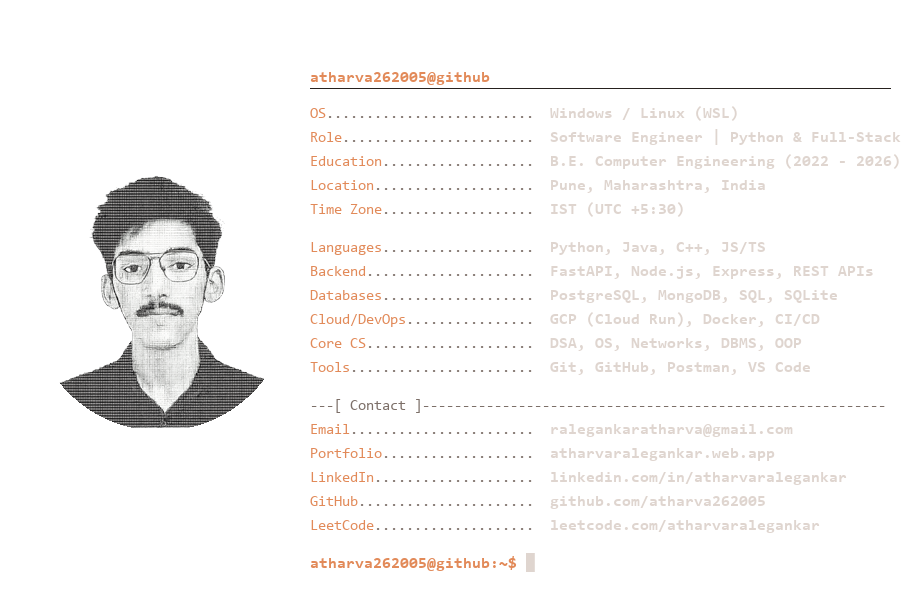
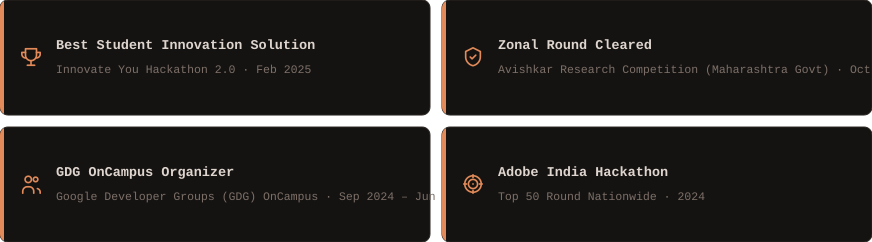

<!--
  Color Theme:
  Main BG:      #0d0b0a
  Card BG:      #151311
  Accent:       #e28a59
  Body Text:    #dfd5cf
  Muted:        #7c6f68
  Border:       #26211e
-->

  

 

<table width="100%" border="0" cellpadding="0" cellspacing="5">
  <tr>
    <!-- Languages Card -->
    <td width="50%" valign="top">
      
    </td>
    <!-- Streak Card -->
    <td width="50%" valign="top">
      
    </td>
  </tr>
  <tr>
    <!-- GitHub Stats Card -->
    <td colspan="2" width="100%" valign="top">
      
    </td>
  </tr>
</table>

 

 

  
  &nbsp;&nbsp;
  
  &nbsp;&nbsp;
  
  &nbsp;&nbsp;
  

  <em>"Code. Build. Ship. Repeat."</em> 
  <strong>— Atharva Ralegankar</strong>

